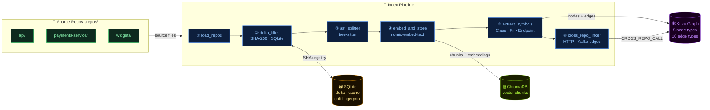

# friendbuy-ai

A production-grade **Hybrid Vector + Graph RAG** pipeline for querying the Friendbuy codebase with natural language. A local **Qwen** model (Ollama) curates context; **Claude** (Anthropic API) reasons over it and produces precise, code-aware answers.

Four search signals fused via **RRF + cross-encoder reranking**, with semantic caching, structured logging, drift detection, and an LLM-as-judge eval harness — all behind a FastAPI server with an interactive D3.js knowledge-graph viewer.

| Signal | What it finds |
|--------|--------------|
| 🔵 **Dense vector** | Semantic similarity via `nomic-embed-text` |
| 🟡 **BM25 sparse** | Exact keywords — function names, env vars, error codes |
| 🟢 **Graph traversal** | Structural relationships — class hierarchies, imports, API handlers |
| ⚡ **Semantic cache** | Sub-millisecond answers for near-duplicate questions (cosine ≥ 0.93) |

---

## Architecture

> **Interactive diagram:** open `docs/architecture.drawio` in [diagrams.net](https://app.diagrams.net), draw.io Desktop, or the VS Code draw.io extension for the full colour-coded view.
> Regenerate any time with `/diagram` inside Claude Code.

### Index Pipeline



### Query Pipeline

```mermaid
flowchart TB
    classDef user   fill:#1a0010,stroke:#f43f5e,color:#fda4af
    classDef cache  fill:#1a1000,stroke:#f59e0b,color:#fbbf24
    classDef ret    fill:#0d1f3d,stroke:#3b82f6,color:#93c5fd
    classDef bm25   fill:#1a1200,stroke:#eab308,color:#fde047
    classDef graph  fill:#0a1a0a,stroke:#22c55e,color:#86efac
    classDef fuse   fill:#1a0a1a,stroke:#a855f7,color:#d8b4fe
    classDef local  fill:#1a1000,stroke:#f97316,color:#fdba74
    classDef claude fill:#0d1f3d,stroke:#818cf8,color:#c7d2fe
    classDef out    fill:#0a1a0a,stroke:#22c55e,color:#4ade80

    Q(["👤 User Question"]):::user

    subgraph CACHE["⚡ Semantic Cache  CP4"]
        SC{"cosine ≥ 0.93?"}:::cache
    end

    subgraph HYBRID["🔍 Hybrid Retriever  CP3"]
        direction LR
        VEC["🔵 Vector\nChromaDB top-20"]:::ret
        BM["🟡 BM25\nrank-bm25 top-20"]:::bm25
        GR["🟢 Graph\nKuzu 1-2 hops"]:::graph
    end

    RRF["⚗️ RRF Fusion  k=60"]:::fuse
    RERANK["🎯 Cross-Encoder\nflashrank ms-marco-MiniLM"]:::fuse
    QWEN["🦙 Qwen 2.5:3b  (local)\ncontext curation"]:::local
    CLAUDE["✨ Claude claude-sonnet-4-5\nreason · cite · answer"]:::claude
    ANS(["📝 Answer + trace log"]):::out

    Q --> SC
    SC -->|"⚡ HIT"| ANS
    SC -->|MISS| VEC & BM & GR
    VEC & BM & GR --> RRF --> RERANK --> QWEN --> CLAUDE
    CLAUDE -->|"store result"| SC
    CLAUDE --> ANS
```

---

## Knowledge graph schema

After indexing, Kuzu holds a full structural map of your codebase:

| Node | Represents |
|------|-----------|
| `Repo` | Top-level repository folder |
| `File` | Every source file indexed |
| `Class` | Every Python / JS / TS class definition |
| `Function` | Every function and method |
| `APIEndpoint` | FastAPI / Express routes (`@router.get`, `app.post`, …) |

| Edge | Meaning |
|------|---------|
| `BELONGS_TO_REPO` | File lives in Repo |
| `CONTAINS_CLASS` | File defines Class |
| `CONTAINS_FUNCTION` | File defines Function |
| `METHOD_OF` | Function is a method of Class |
| `INHERITS` | Class extends another Class |
| `EXPOSES` | File registers an APIEndpoint |
| `HANDLES` | APIEndpoint is handled by Function |
| `IMPORT_DEP` | File imports symbols from another File |
| `CROSS_REPO_CALL` | File calls another repo via HTTP or Kafka (CP4) |

---

## Prerequisites

| Tool | Version | Install |
|------|---------|---------|
| Python | **3.11 or 3.12** *(not 3.13+)* | [python.org](https://python.org) |
| Ollama | latest | `brew install ollama` |
| Anthropic API key | — | [console.anthropic.com](https://console.anthropic.com) |

> **Why 3.11 / 3.12?** `kuzu` has no pre-built wheel for Python 3.13+.

### Pull the required Ollama models

```bash
ollama pull qwen2.5:3b
ollama pull nomic-embed-text
```

---

## Installation

```bash
# 1. Enter the project directory
cd friendbuy-ai

# 2. Create a venv on Python 3.11 or 3.12
python3.12 -m venv .venv
source .venv/bin/activate         # Windows: .venv\Scripts\activate

# 3. Install all dependencies
pip install -r requirements.txt

# Optional: cross-encoder reranking (~22 MB model on first use)
pip install flashrank>=0.2

# 4. Configure environment variables
cp .env.example .env
# Edit .env:
#   ANTHROPIC_API_KEY=sk-ant-…
#   API_KEY=your-server-secret      ← optional: enables Bearer token auth
```

---

## Adding repos

Drop any cloned Friendbuy repos into `./repos/`:

```bash
cd repos/
git clone git@github.com:friendbuy/api.git
git clone git@github.com:friendbuy/payments-service.git
git clone git@github.com:friendbuy/widgets.git
```

Each top-level folder becomes a named "repo" you can scope queries to.

---

## CLI Usage

### Build the knowledge base

```bash
# First run — index all repos, build vector store + graph + BM25
python cli.py index

# Wipe everything and rebuild from scratch (also records drift fingerprint)
python cli.py index --reindex

# Vector index only — skip Kuzu graph
python cli.py index --no-graph
```

Only **changed files** are re-embedded on subsequent runs (SHA-256 delta tracking). A drift warning is shown if the embedding model changed since the last `--reindex`.

### Ask questions

```bash
# Full hybrid retrieval (vector + BM25 + graph) + semantic cache — default
python cli.py ask "How does the referral tracking flow work?"

# Scope to a single repo
python cli.py ask "Where is the Stripe webhook handler?" --repo payments-service

# Disable graph traversal
python cli.py ask "What does CampaignService do?" --no-graph

# Disable BM25
python cli.py ask "List all API endpoints" --no-bm25

# Pure vector search
python cli.py ask "Find the reward logic" --no-graph --no-bm25
```

**Cache hit** — sub-millisecond, skips all LLM calls:
```
⚡ Cache hit  (similarity 0.961)
```

**Cache miss** — shows full retrieval breakdown:
```
Retrieval (143ms): vector:5  BM25:3  graph:2  entities:CampaignService
```

### Statistics

```bash
python cli.py stats        # vector index stats (chunks per repo)
python cli.py graph-stats  # knowledge graph stats (nodes + edges per type)
```

---

## Graph Viewer

An **Obsidian-style interactive D3.js graph browser** ships at `/graph/ui`.

```bash
# Start the server
python -m api.server

# Open in browser
open http://localhost:8000/graph/ui
```

Features:
- 🌑 Dark canvas with force-directed physics (D3 v7)
- 🎨 Color-coded by node type — Repo (blue) · File (grey) · Class (green) · Function (orange) · Endpoint (pink)
- 🔍 Search bar — filters nodes + edges in real time
- 📋 Sidebar — filter by node type, edge type, and repo
- 🖱 Click node → detail panel · Double-click → focus subgraph
- ⚙️ Physics controls — link distance, repulsion, pause/resume

> Run `python cli.py index --reindex` first to populate Class / Function / APIEndpoint nodes.

---

## Eval harness (CP5)

```bash
# Full eval — LLM judge via claude-haiku-4-5 (~$0.01 for 10 questions)
python -m eval.ragas_eval

# Heuristic-only scoring — free and instant
python -m eval.ragas_eval --dry-run

# Custom questions file
python -m eval.ragas_eval --questions eval/golden_questions.jsonl --output eval/results.jsonl

# Scoped to one repo
python -m eval.ragas_eval --repo payments-service
```

**Example summary:**
```
           Eval Summary
┌────────────────────┬─────────────┐
│ Metric             │ Value       │
├────────────────────┼─────────────┤
│ Questions          │ 10          │
│ Mean faithfulness  │ 4.20 / 5    │
│ Mean completeness  │ 3.80 / 5    │
│ Mean relevance     │ 4.50 / 5    │
│ Mean file recall   │ 72.0%       │
│ Cache hit rate     │ 30.0%       │
└────────────────────┴─────────────┘
```

---

## FastAPI server

```bash
# Start (default: http://localhost:8000)
python -m api.server

# With auto-reload for development
uvicorn api.server:app --reload --port 8000
```

### Authentication

Set `API_KEY=your-secret` in `.env` to enable Bearer token auth.
When unset, the API is open (useful for local dev):

```bash
curl -X POST http://localhost:8000/ask \
  -H "Authorization: Bearer your-secret" \
  -H "Content-Type: application/json" \
  -d '{"query": "How does referral attribution work?"}'
```

### Endpoints

| Method | Path | Auth | Description |
|--------|------|:----:|-------------|
| `GET`  | `/health` | — | Liveness check |
| `GET`  | `/ready` | — | Readiness probe (ChromaDB + Ollama) |
| `GET`  | `/stats` | — | Index statistics |
| `POST` | `/index?reindex=false` | — | Trigger (re-)indexing — async |
| `GET`  | `/index/status/{job_id}` | — | Poll indexing job |
| `POST` | `/ask` | 🔑 | Answer a question (hybrid RAG + cache) |
| `GET`  | `/graph/traverse?entity=X&hops=2` | 🔑 | Graph traversal from a named entity |
| `GET`  | `/graph/ui` | — | Interactive D3.js knowledge graph browser |
| `GET`  | `/graph/viz/data` | — | Graph nodes + edges as JSON |
| `POST` | `/cache/invalidate` | — | Clear the semantic query cache |

---

## Structured logging (CP5)

All query and index events are written as JSON lines to `cache/app.log`:

```json
{"ts":"2025-06-01T10:30:00Z","level":"INFO","event":"query.start","query_id":"uuid","query":"How does referral attribution work?"}
{"ts":"2025-06-01T10:30:00Z","level":"INFO","event":"cache.hit","similarity":0.961}
{"ts":"2025-06-01T10:30:00Z","level":"INFO","event":"retrieval.done","vector":5,"bm25":3,"graph":2,"ms":143}
{"ts":"2025-06-01T10:30:00Z","level":"INFO","event":"llm.done","model":"claude-sonnet-4-5","input_tokens":3821,"output_tokens":312,"ms":1840}
```

Set `LOG_LEVEL=DEBUG` in `.env` for verbose output.

---

## Running tests

```bash
# All 181 tests — no Ollama, ChromaDB, or Kuzu required
pytest tests/ -v

# By checkpoint
pytest tests/test_ast_parser.py -v        # CP2 — symbol extraction    (48 tests)
pytest tests/test_delta_tracker.py -v     # CP2 — delta tracking       (28 tests)
pytest tests/test_bm25.py -v              # CP3 — BM25 tokeniser       (15 tests)
pytest tests/test_hybrid_retriever.py -v  # CP3 — RRF fusion           (14 tests)
pytest tests/test_semantic_cache.py -v    # CP4 — semantic cache       (19 tests)
pytest tests/test_reranker.py -v          # CP4 — reranker             (11 tests)
pytest tests/test_eval_harness.py -v      # CP5 — eval harness         (21 tests)
pytest tests/test_auth.py -v              # CP5 — API key auth         (10 tests)
pytest tests/test_drift_detector.py -v    # CP5 — drift detection      (15 tests)
```

---

## Architecture diagram (draw.io)

The file `docs/architecture.drawio` contains a full dark-theme diagram of the entire system.

**Open with:**
- **[diagrams.net](https://app.diagrams.net)** — free in-browser, no install → `File › Open from › Device`
- **draw.io Desktop** → `File › Open`
- **VS Code** — install the [draw.io extension](https://marketplace.visualstudio.com/items?itemName=hediet.vscode-drawio) → right-click the file → `Open with draw.io`

**Regenerate at any time** by typing `/diagram` inside Claude Code.

---

## Project structure

```
friendbuy-ai/
├── .env.example                  ← copy to .env, fill in your API key
├── .claude/
│   └── commands/
│       └── diagram.md            ← /diagram skill: regenerate architecture diagram
├── requirements.txt
├── config.py                     ← all settings (reads from .env)
├── cli.py                        ← CLI entry point
│
├── indexer/
│   ├── repo_loader.py            ← walks ./repos/, returns Documents
│   ├── splitter.py               ← tree-sitter AST-aware chunking (CP1)
│   ├── ast_parser.py             ← symbol extraction: NodeBatch / EdgeBatch (CP2)
│   ├── embedder.py               ← nomic-embed-text → ChromaDB (CP0)
│   ├── delta_tracker.py          ← SQLite: skip unchanged files (CP0/CP2)
│   ├── graph_builder.py          ← Kuzu: upsert all node/edge types (CP2)
│   ├── cross_repo_linker.py      ← HTTP/Kafka cross-repo edges (CP4)
│   └── drift_detector.py         ← embedding model change detection (CP5)
│
├── retriever/
│   ├── vector_search.py          ← ChromaDB cosine similarity search
│   ├── bm25_index.py             ← BM25 sparse keyword index (CP3)
│   ├── graph_search.py           ← Kuzu traversal + entity extraction (CP3)
│   ├── hybrid_retriever.py       ← RRF fusion of all 3 signals (CP3)
│   ├── reranker.py               ← flashrank cross-encoder reranker (CP4)
│   ├── semantic_cache.py         ← SQLite query cache, cosine threshold (CP4)
│   └── context_filter.py         ← Qwen (local) curates + summarises chunks
│
├── pipeline/
│   ├── index_pipeline.py         ← unified indexing orchestrator (CP2/CP4/CP5)
│   └── query_pipeline.py         ← cache → hybrid → rerank → Qwen → Claude (CP3/CP4/CP5)
│
├── api/
│   ├── auth.py                   ← Bearer token auth dependency (CP5)
│   ├── graph_viz.py              ← D3.js graph viewer + /graph/viz/data endpoint
│   └── server.py                 ← FastAPI server
│
├── observability/
│   └── logger.py                 ← structured JSON logger (CP5)
│
├── eval/
│   ├── golden_questions.jsonl    ← 10 golden Q&A pairs (CP5)
│   └── ragas_eval.py             ← LLM-as-judge eval harness (CP5)
│
├── docs/
│   └── architecture.drawio       ← full system architecture (open in draw.io)
│
├── tests/
│   ├── test_ast_parser.py        ← 48 tests  (CP2)
│   ├── test_delta_tracker.py     ← 28 tests  (CP2)
│   ├── test_bm25.py              ← 15 tests  (CP3)
│   ├── test_hybrid_retriever.py  ← 14 tests  (CP3)
│   ├── test_semantic_cache.py    ← 19 tests  (CP4)
│   ├── test_reranker.py          ← 11 tests  (CP4)
│   ├── test_eval_harness.py      ← 21 tests  (CP5)
│   ├── test_auth.py              ← 10 tests  (CP5)
│   └── test_drift_detector.py    ← 15 tests  (CP5)
│
├── repos/                        ← drop cloned repos here
├── cache/                        ← SQLite registry + query cache (gitignored)
├── friendbuy-knowledge-base/     ← ChromaDB vector store (gitignored)
└── friendbuy-graph-db/           ← Kuzu graph database (gitignored)
```

---

## Configuration reference

| Variable | Default | Description |
|----------|---------|-------------|
| `ANTHROPIC_API_KEY` | *(required)* | Your Anthropic API key |
| `OLLAMA_BASE_URL` | `http://localhost:11434` | Ollama server URL |
| `LOCAL_MODEL` | `qwen2.5:3b` | Local model for context filtering |
| `EMBEDDING_MODEL` | `nomic-embed-text` | Embedding model |
| `CLAUDE_MODEL` | `claude-sonnet-4-5` | Claude model for answers |
| `CHROMA_PERSIST_DIR` | `./friendbuy-knowledge-base` | ChromaDB storage path |
| `REPOS_DIR` | `./repos` | Source repos directory |
| `TOP_K_RESULTS` | `5` | Final chunks after RRF + reranking |
| `MIN_RELEVANCE_SCORE` | `0.30` | Minimum vector similarity |
| `CHUNK_SIZE` | `1000` | Characters per chunk |
| `CHUNK_OVERLAP` | `200` | Character overlap between chunks |
| `EMBED_BATCH_SIZE` | `100` | Chunks per Ollama embed call |
| `FILE_SIZE_CAP_BYTES` | `512000` | Skip files larger than 500 KB |
| `GRAPH_DB_DIR` | `./friendbuy-graph-db` | Kuzu graph storage path |
| `USE_GRAPH` | `true` | Enable graph traversal |
| `USE_BM25` | `true` | Enable BM25 sparse search |
| `HYBRID_RRF_K` | `60` | RRF constant |
| `VECTOR_TOP_K` | `20` | Dense search candidates before RRF |
| `BM25_TOP_K` | `20` | BM25 candidates before RRF |
| `GRAPH_MAX_HOPS` | `2` | Max traversal depth in Kuzu |
| `USE_SEMANTIC_CACHE` | `true` | Enable semantic query cache |
| `SEMANTIC_CACHE_THRESHOLD` | `0.93` | Cosine threshold for cache hit |
| `SEMANTIC_CACHE_MAX_SIZE` | `1000` | Max cached queries (LRU eviction) |
| `USE_RERANKER` | `true` | Cross-encoder reranking via flashrank |
| `USE_CROSS_REPO_LINKING` | `true` | Detect HTTP/Kafka cross-repo edges |
| `CACHE_DIR` | `./cache` | SQLite files directory |
| `LOG_LEVEL` | `INFO` | `DEBUG` · `INFO` · `WARNING` · `ERROR` |
| `LOG_FILE` | `./cache/app.log` | JSON log file (`""` to disable) |
| `API_KEY` | *(unset)* | Bearer token for protected endpoints |
| `DRIFT_SIMILARITY_THRESHOLD` | `0.999` | Cosine threshold for drift detection |

---

## Checkpoint roadmap

| CP | Status | What it delivers |
|----|:------:|-----------------|
| **CP0** | ✅ | Stable IDs · delta tracking · atomic reindex · async FastAPI |
| **CP1** | ✅ | Tree-sitter AST chunking · Kuzu schema · Repo/File nodes |
| **CP2** | ✅ | Full symbol extraction · Class/Function/Endpoint nodes + edges |
| **CP3** | ✅ | BM25 sparse search · graph traversal · RRF fusion · trace log |
| **CP4** | ✅ | Semantic query cache · cross-encoder reranker · cross-repo edges |
| **CP5** | ✅ | Eval harness · LLM-as-judge · structured logging · auth · drift detection |

---

## Memory notes (M1 Air, 8 GB RAM)

- `qwen2.5:3b` — ~2 GB RAM; `nomic-embed-text` — ~300 MB
- ChromaDB and Kuzu store everything on disk — only active chunks in RAM
- BM25 index — ~5 MB in-memory for 5 000 chunks
- Semantic cache — single SQLite file, ~2 ms linear cosine scan for 1 000 entries
- FlashRank model — ~22 MB, loaded once and held for the process lifetime
- Eval harness — ~$0.001 per question using claude-haiku-4-5
- If you run out of memory during indexing, reduce `CHUNK_SIZE` to `500`
