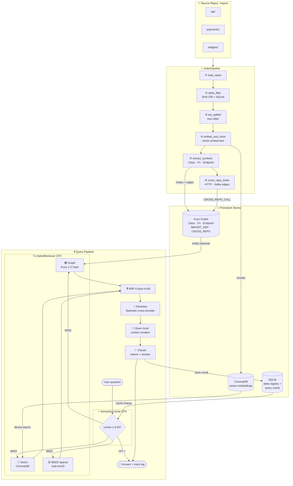

# friendbuy-ai

A production-grade **Hybrid Vector + Graph RAG** pipeline for querying the Friendbuy codebase with natural language. A local **Qwen** model (Ollama) curates context; **Claude** (Anthropic API) reasons over it and produces precise, code-aware answers.

Four search signals fused using **RRF + cross-encoder reranking**:
- 🔵 **Dense vector search** — semantic similarity via `nomic-embed-text`
- 🟡 **BM25 sparse search** — exact keyword matching (function names, error codes, env vars)
- 🟢 **Graph traversal** — structural relationships from the Kuzu knowledge graph
- ⚡ **Semantic cache** — sub-millisecond answers for near-duplicate questions (cosine ≥ 0.93)

---

## Architecture



---

## What's in the knowledge graph

After indexing, Kuzu holds a full structural map of your codebase:

| Node type | What it represents |
|-----------|-------------------|
| `Repo` | A top-level repository folder |
| `File` | Every source file indexed |
| `Class` | Every Python / JS / TS class definition |
| `Function` | Every function and method |
| `APIEndpoint` | FastAPI / Express routes (`@router.get`, `app.post`, …) |

| Edge | Meaning |
|------|---------|
| `BELONGS_TO_REPO` | File lives in Repo |
| `CONTAINS_CLASS` | File defines Class |
| `CONTAINS_FUNCTION` | File defines Function |
| `METHOD_OF` | Function is a method of Class |
| `INHERITS` | Class extends another Class |
| `EXPOSES` | File registers an APIEndpoint |
| `HANDLES` | APIEndpoint is handled by Function |
| `IMPORT_DEP` | File imports symbols from another File |
| `CROSS_REPO_CALL` | File calls another repo via HTTP or Kafka (CP4) |

---

## Prerequisites

| Tool | Version | Install |
|------|---------|---------|
| Python | **3.11 or 3.12** *(not 3.13+)* | [python.org](https://python.org) |
| Ollama | latest | `brew install ollama` |
| Anthropic API key | — | [console.anthropic.com](https://console.anthropic.com) |

> **Why 3.11 / 3.12?** The `kuzu` graph database has no pre-built wheel for Python 3.13+. Everything else works on any modern Python.

### Pull the required Ollama models

```bash
ollama pull qwen2.5:3b
ollama pull nomic-embed-text
```

---

## Installation

```bash
# 1. Clone / enter this repo
cd friendbuy-ai

# 2. Create venv on Python 3.11 or 3.12
python3.12 -m venv .venv
source .venv/bin/activate         # Windows: .venv\Scripts\activate

# 3. Install dependencies  (includes rank-bm25, kuzu, tree-sitter)
pip install -r requirements.txt

# Optional: enable cross-encoder reranking (adds ~22 MB model download on first use)
pip install flashrank>=0.2

# 4. Configure environment variables
cp .env.example .env
# Open .env and set ANTHROPIC_API_KEY=sk-ant-…
```

---

## Adding repos

Drop any cloned Friendbuy repos into the `./repos/` directory:

```bash
cd repos/
git clone git@github.com:friendbuy/api.git
git clone git@github.com:friendbuy/payments-service.git
git clone git@github.com:friendbuy/widgets.git
```

Each top-level folder inside `./repos/` becomes a named "repo" that you can scope queries to.

---

## CLI Usage

### Build the knowledge base

```bash
# First run — indexes all repos, builds vector store + knowledge graph + BM25
python cli.py index

# Wipe everything and rebuild from scratch
python cli.py index --reindex

# Vector index only (skip Kuzu graph)
python cli.py index --no-graph
```

On subsequent runs without `--reindex`, only **changed files** are re-embedded and re-extracted (delta tracking). Unchanged files are skipped automatically.

### Ask questions

```bash
# Full hybrid retrieval (vector + BM25 + graph) + semantic cache — default
python cli.py ask "How does the referral tracking flow work?"

# Scope to a single repo
python cli.py ask "Where is the Stripe webhook handler?" --repo payments-service

# Disable graph traversal (vector + BM25 only)
python cli.py ask "What does CampaignService do?" --no-graph

# Disable BM25 (vector + graph only)
python cli.py ask "List all API endpoints" --no-bm25

# Pure vector search
python cli.py ask "Find the reward logic" --no-graph --no-bm25
```

**Cache hit** — sub-millisecond, skips all LLM calls:
```
⚡ Cache hit  (similarity 0.961)
```

**Cache miss** — shows full retrieval breakdown:
```
Retrieval (143ms): vector:5  BM25:3  graph:2  entities:CampaignService
```

### Show statistics

```bash
# Vector index stats (chunks per repo)
python cli.py stats

# Knowledge graph stats (nodes + edges per type)
python cli.py graph-stats
```

---

## FastAPI server (optional)

```bash
# Start the API server (default: http://localhost:8000)
python -m api.server

# Or with auto-reload for development
uvicorn api.server:app --reload --port 8000
```

### Endpoints

| Method | Path | Description |
|--------|------|-------------|
| `GET`  | `/health` | Liveness check |
| `GET`  | `/ready` | Readiness probe (ChromaDB + Ollama) |
| `GET`  | `/stats` | Index statistics |
| `POST` | `/index?reindex=false` | Trigger (re-)indexing — async, returns `job_id` |
| `GET`  | `/index/status/{job_id}` | Poll indexing job status |
| `POST` | `/ask` | Ask a question (hybrid retrieval + cache) |
| `GET`  | `/graph/traverse?entity=X&hops=2` | Traverse the graph from a named entity *(CP4)* |
| `POST` | `/cache/invalidate` | Clear the semantic query cache *(CP4)* |

#### Ask via curl

```bash
curl -X POST http://localhost:8000/ask \
  -H "Content-Type: application/json" \
  -d '{"query": "How does referral attribution work?", "repo": null}'
```

#### Graph traversal

```bash
curl "http://localhost:8000/graph/traverse?entity=CampaignService&hops=2"
```

#### Invalidate semantic cache

```bash
curl -X POST http://localhost:8000/cache/invalidate
# → {"deleted": 42, "message": "Deleted 42 cached query entries."}
```

#### Trigger index and poll

```bash
JOB=$(curl -s -X POST "http://localhost:8000/index" | jq -r .job_id)
curl "http://localhost:8000/index/status/$JOB"
```

---

## Running tests

```bash
# All 135 tests — no Ollama, ChromaDB, or Kuzu required
pytest tests/ -v

# Individual test files
pytest tests/test_ast_parser.py -v       # CP2 — symbol extraction  (48 tests)
pytest tests/test_delta_tracker.py -v    # CP2 — delta tracking     (28 tests)
pytest tests/test_bm25.py -v             # CP3 — BM25 tokeniser + search (15 tests)
pytest tests/test_hybrid_retriever.py -v # CP3 — RRF fusion         (14 tests)
pytest tests/test_semantic_cache.py -v   # CP4 — semantic cache     (19 tests)
pytest tests/test_reranker.py -v         # CP4 — reranker           (11 tests)
```

---

## Query trace log

Every `ask` query appends a trace record to `cache/query_traces.jsonl`:

```json
{
  "query_id": "uuid",
  "query": "what does CampaignService create?",
  "vector_chunks": 5,
  "bm25_chunks": 3,
  "graph_chunks": 2,
  "graph_entities": ["CampaignService"],
  "total_fused_chunks": 8,
  "retrieval_ms": 143.2,
  "llm_ms": 1840.5,
  "input_tokens": 3821,
  "output_tokens": 312,
  "timestamp": "2025-06-01T10:30:00Z"
}
```

Cache hits are **not** written to the trace log (no LLM was invoked).
Useful for spotting slow queries, measuring cache hit rates, and building the eval dataset (CP5).

---

## Project structure

```
friendbuy-ai/
├── .env.example                  ← copy to .env, fill in your API key
├── requirements.txt
├── config.py                     ← all settings (reads from .env)
├── cli.py                        ← CLI entry point
│
├── indexer/
│   ├── repo_loader.py            ← walks ./repos/, returns LangChain Documents
│   ├── splitter.py               ← tree-sitter AST-aware chunking (CP1)
│   ├── ast_parser.py             ← full symbol extraction: NodeBatch/EdgeBatch (CP2)
│   ├── embedder.py               ← nomic-embed-text → ChromaDB + graph Repo/File nodes
│   ├── delta_tracker.py          ← SQLite registry: skip unchanged files (CP0/CP2)
│   ├── graph_builder.py          ← Kuzu: upsert all node/edge types (CP2)
│   └── cross_repo_linker.py      ← HTTP/Kafka cross-repo edge detection (CP4)
│
├── retriever/
│   ├── vector_search.py          ← ChromaDB cosine similarity search
│   ├── bm25_index.py             ← BM25 sparse keyword index (CP3)
│   ├── graph_search.py           ← Kuzu traversal + entity extraction (CP3)
│   ├── hybrid_retriever.py       ← RRF fusion of all 3 signals (CP3)
│   ├── reranker.py               ← flashrank cross-encoder reranker (CP4)
│   ├── semantic_cache.py         ← SQLite query cache, cosine threshold (CP4)
│   └── context_filter.py         ← Qwen (local) curates + summarises chunks
│
├── pipeline/
│   ├── index_pipeline.py         ← unified indexing orchestrator (CP2/CP4)
│   └── query_pipeline.py         ← cache → hybrid → rerank → Qwen → Claude (CP3/CP4)
│
├── api/
│   └── server.py                 ← FastAPI server (+ /graph/traverse, /cache/invalidate)
│
├── tests/
│   ├── test_ast_parser.py        ← 48 tests  (CP2)
│   ├── test_delta_tracker.py     ← 28 tests  (CP2)
│   ├── test_bm25.py              ← 15 tests  (CP3)
│   ├── test_hybrid_retriever.py  ← 14 tests  (CP3)
│   ├── test_semantic_cache.py    ← 19 tests  (CP4)
│   └── test_reranker.py          ← 11 tests  (CP4)
│
├── repos/                        ← drop cloned Friendbuy repos here
├── cache/                        ← SQLite delta registry + query cache (gitignored)
├── friendbuy-knowledge-base/     ← ChromaDB vector store (gitignored)
└── friendbuy-graph-db/           ← Kuzu graph database (gitignored)
```

---

## Configuration reference

| Variable | Default | Description |
|----------|---------|-------------|
| `ANTHROPIC_API_KEY` | *(required)* | Your Anthropic API key |
| `OLLAMA_BASE_URL` | `http://localhost:11434` | Ollama server URL |
| `LOCAL_MODEL` | `qwen2.5:3b` | Local Qwen model for context filtering |
| `EMBEDDING_MODEL` | `nomic-embed-text` | Embedding model |
| `CHROMA_PERSIST_DIR` | `./friendbuy-knowledge-base` | Where ChromaDB stores data |
| `REPOS_DIR` | `./repos` | Where you drop cloned repos |
| `TOP_K_RESULTS` | `5` | Final chunks returned after RRF + reranking |
| `MIN_RELEVANCE_SCORE` | `0.30` | Minimum vector similarity score |
| `CLAUDE_MODEL` | `claude-sonnet-4-5` | Claude model for answers |
| `CHUNK_SIZE` | `1000` | Characters per chunk |
| `CHUNK_OVERLAP` | `200` | Character overlap between chunks |
| `EMBED_BATCH_SIZE` | `100` | Chunks per Ollama embed call |
| `FILE_SIZE_CAP_BYTES` | `512000` | Skip files larger than 500 KB |
| `GRAPH_DB_DIR` | `./friendbuy-graph-db` | Where Kuzu stores the graph |
| `USE_GRAPH` | `true` | Set `false` to disable graph entirely |
| `USE_BM25` | `true` | Set `false` to disable BM25 sparse search |
| `HYBRID_RRF_K` | `60` | RRF constant (higher = less rank-difference sensitivity) |
| `VECTOR_TOP_K` | `20` | Candidates from dense search before RRF |
| `BM25_TOP_K` | `20` | Candidates from BM25 before RRF |
| `GRAPH_MAX_HOPS` | `2` | Max traversal depth in Kuzu |
| `USE_SEMANTIC_CACHE` | `true` | Enable semantic query cache |
| `SEMANTIC_CACHE_THRESHOLD` | `0.93` | Cosine similarity threshold for cache hits |
| `SEMANTIC_CACHE_MAX_SIZE` | `1000` | Max cached queries (oldest evicted beyond this) |
| `USE_RERANKER` | `true` | Cross-encoder reranking via flashrank |
| `USE_CROSS_REPO_LINKING` | `true` | Detect HTTP/Kafka cross-repo call edges |
| `CACHE_DIR` | `./cache` | SQLite delta-tracking DB + query cache |

---

## Checkpoint roadmap

| CP | Status | What it delivers |
|----|--------|-----------------|
| **CP0** | ✅ Done | Stable IDs · delta tracking · atomic reindex · async API |
| **CP1** | ✅ Done | Tree-sitter AST chunking · Kuzu schema · Repo/File nodes |
| **CP2** | ✅ Done | Full symbol extraction · Class/Function/Endpoint nodes + edges · unified pipeline |
| **CP3** | ✅ Done | BM25 sparse search · graph traversal · RRF fusion · trace logging |
| **CP4** | ✅ Done | Semantic query cache · cross-encoder reranker · cross-repo HTTP/Kafka edges |
| CP5 | Planned | Eval harness · LLM-as-judge scoring · observability · API key auth |

---

## Memory notes (M1 Air, 8 GB RAM)

- Embeddings are batched in groups of 100 to avoid OOM.
- `qwen2.5:3b` uses ~2 GB RAM; `nomic-embed-text` uses ~300 MB.
- ChromaDB stores vectors on disk — only loaded chunks stay in RAM.
- Kuzu stores the graph on disk — negligible RAM overhead.
- BM25 index is built in-memory (~5 MB for 5 000 chunks) — fine on M1.
- Semantic cache is a single SQLite file + linear cosine scan (~2 ms for 1 000 entries).
- FlashRank model is ~22 MB; loaded once and cached for the process lifetime.
- Quit other heavy apps before indexing large repos.
- If you run out of memory during indexing, reduce `CHUNK_SIZE` to `500`.
